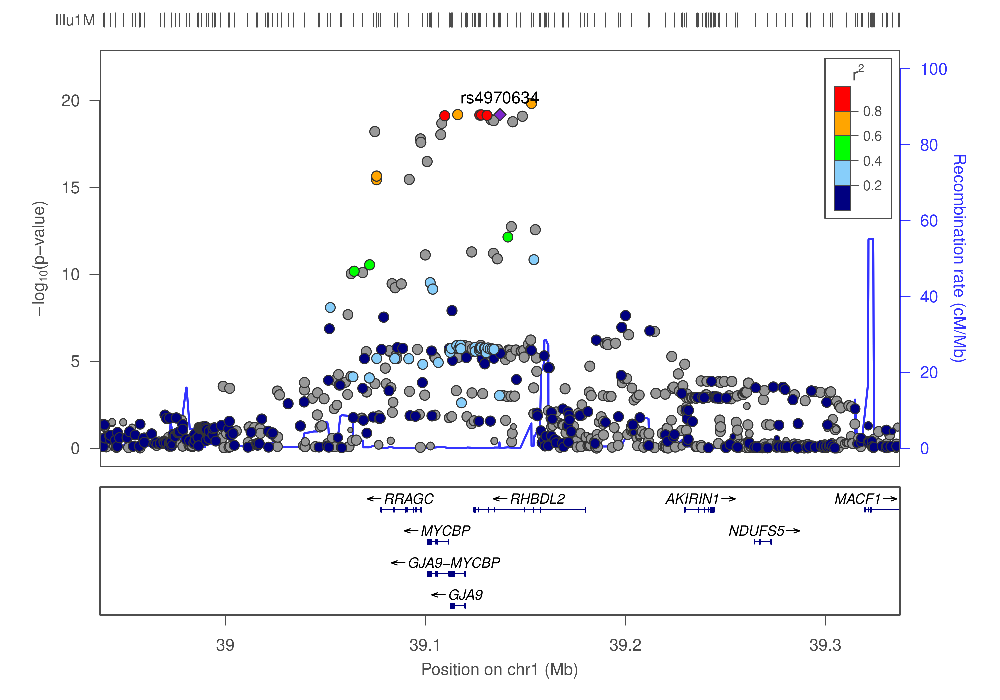

# FM-pipeline

FineMapping analysis using GWAS summary statistics

## INTRODUCTION

This is a pipeline for finemapping using GWAS summary statistics, implemented in Bash as a series of steps to furnish an incremental analysis. As depicted in the diagram below 



where our lead SNP rs4970634 is in LD with many others, the procedure attempts to identify causal variants from region(s) showing significant SNP-trait association.

The process involves the following steps,
1. Extraction of effect (beta)/z statistics from GWAS summary statistics (.sumstats), 
2. Extraction of correlation from the reference panel among overlapped SNPs from 1 and the reference panel containing individual level data. 
3. Information from 1 and 2 above is then used as input for finemapping.

The measure of evidence is typically (log10) Bayes factor (BF) and associate SNP probability in the causal set.

Information on whole-genome analysis, which could be used to set up the regions, are described at the [wiki page](https://github.com/jinghuazhao/FM-pipeline/wiki).
Clumping using PLINK is also included analogous to those used in depict (e.g. description in [PW-pipeline](https://github.com/jinghuazhao/PW-pipeline)).

## INSTALLATION

Software options included in this pipeline are listed in the table below.

**Option** | **Name** | **Function** | **Input** | **Output** | **Reference**
-----------|----------|--------------|-----------|------------|--------------------------------------------------------------
CAVIAR | CAVIAR | finemapping | z, correlation matrix | causal sets and probabilities | Hormozdiari, et al. (2014)
CAVIARBF | CAVIARBF | finemapping | z, correlation matrix | BF and probabilities for all configurations | Chen, et al. (2015)
GCTA | GCTA | joint/conditional analysis | .sumstats, reference data | association results | Yang, et al. (2012)
FM_summary | FM-summary | finemapping | .sumstats | posterior probability & credible set | Huang, et al. (2017)
JAM | JAM | finemapping | beta, individual reference data | Bayes Factor of being causal | Newcombe, et al. (2016)
LocusZoom | LocusZoom | regional plot | .sumstats | .pdf/.png plots | Pruim, et al. (2010)
fgwas | fgwas | functional GWAS | .sumstats | functional significance | Pickrell (2014)
finemap | finemap | finemapping | z, correlation matrix | causal SNPs and configuration | Benner, et al. (2016)

so they range from regional association plots via LocusZoom, joint/conditional analysis via GCTA, functional annotation via fgwas to dedicated finemapping software including CAVIAR, 
CAVIARBF, an adapted version of FM-summary, R2BGLiMS/JAM and finemap. One can optionally use a subset of these for a particular analysis by specifying relevant flags from the 
pipeline's settings.

On many occasions, the pipeline takes advantage of the [GNU parallel](http://www.gnu.org/software/parallel/).
Besides (sub)set of software listed in the table above, the pipeline requires [qctool](http://www.well.ox.ac.uk/~gav/qctool/#overview) 2.0,
[PLINK](https://www.cog-genomics.org/plink2) 1.9, and the companion program LDstore from finemap's website need to be installed. 
To facilitate handling of grapahics, e.g., importing them into Excel, pdftopng from [XpdfReader](https://www.xpdfreader.com/) is used.
We use [Stata](https://www.stata.com/) and Sun grid engine (sge) for some of the data preparation, which would become handy when available.

The pipeline itself can be installed in the usual way,
```
git clone https://github.com/jinghuazhao/FM-pipeline
```

## USAGE

An [fmp.ini](fmp.ini) needs to be present at the working directory,

The pipeline is then called with
```
bash fmp.sh <input>
```

## Inputs

### --- GWAS summary statistics ---

The input will be GWAS summary statistics described at the SUMSTATS repository, https://github.com/jinghuazhao/SUMSTATS, in line with joint/conditional analysis by GCTA involving chromosomal positions.

### --- Reference panel ---

The pipeline uses a reference panel in a .gen.gz format, taking into account directions of effect in both the GWAS summary statistics and the reference panel. Its 
development will facilitate summary statistics from a variety of consortiua as with reference panels such as the HRC and 1000Genomes.

A .gen.gz file is required for each region, named such that chr{chr}\_{start}\_{end}.gen.gz, together with a sample file. For our own data, [st.do](files/st.do) is
written to generate such files from their whole chromosome counterpart using SNPinfo.dta.gz which has the following information,

chr |        rsid  |      RSnum |    pos |    FreqA2 |    info  | type |  A1  | A2
----|--------------|-------------|--------|-----------|----------|------|------|----
 1  | 1:54591_A_G  | rs561234294 |  54591 |  .0000783 |  .33544  |    0 |   A  |  G  
 1  | 1:55351_T_A  | rs531766459 |  55351 |  .0003424 |   .5033  |    0 |   T  |  A  
... | ... | ... | ... | ... | ... | ... | ... | ... |

We may also work on a text version for instance SNPinfo.txt.

### --- The lead SNPs ---

The setup is in line with summary statistics from consortia where only RSid are given for the fact that their chromosomal position may be changed
over different builds. An auxiliary file called `st.bed` contains chr, start, end, rsid, pos, r corresponding to the lead SNPs specified and r is
a sequence number of region. 

## Outputs

The output will involve counterpart(s) from individual software, i.e., .set/.post, .caviarbf, .snp/.config/.cred, .jam/.top/.cs

**Software** | **Output type** | **Description**
---------|---------------------|--------------------------------------------------------------
CAVIAR   | .set/.post | causal set and probabilities in the causal set/posterior probabilities
CAVIARBF | .caviarbf | causal configurations and their BFs
FM-summary | .txt | additional information to the GWAS summary statistics
GCTA     | .jma.cojo | joint/conditional analysis results
JAM      | .jam/.top/.cs | posterior summary table, top models containing selected SNPs and credible sets
finemap  | .snp/.config/.cred | SNPs with largest log10(BF), configurations with their log10(BF) and credible sets

It is helpful to examine directions of effects together with their correlation which is now embedded when finemap is involved.

## EXAMPLE

### --- GWAS summary statistics ---

File `bmi.tsv.gz` is described in the SUMSTATS repository, https://github.com/jinghuazhao/SUMSTATS.

### --- 1000Genomes panel ---

The approximately independent LD blocks are available from [1KG/LD-blocks](1KG/LD-blocks), derived from [FUSION LD reference panel](https://data.broadinstitute.org/alkesgroup/FUSION/LDREF.tar.bz2), with
[1KG.sh](1KG/1KG.sh) for `SNPinfo.dta.gz` and [st.do](1KG/st.do) for script [Extract.sh](1KG/Extract.sh).

### --- The lead SNPs ---

From the 97 SNPs described in the SUMSTATS repository, the [st.bed](st.bed) is generated as follows,
```bash
# 97 SNPs
(
  echo -e "chrom\tstart\tend\trsid\tpos\tr"
  sed -i 's/rs12016871/rs9581854/g' 97.snps
  grep -w -f 97.snps snp150.txt | \
  sort -k1,1n -k2,2n | \
  awk -vOFS="\t" '{print "chr" $1,$2-1,$2,$3,$2,NR}'
# awk -vflanking=250000 '{l=$2-flanking;u=$2+flanking;if(l<0) l=0;print $1,l,u,$3,$2,NR}'
) | \
# intersect with approximately independent LD blocks
bedtools intersect -a 1KG/EUR.bed -b - -loj | \
sed 's/chr//g;s/region//g' | \
(
  echo "chr start end rsid pos r"
  awk '$5!="."{print $1,$2,$3,$8,$9,$4}'
) > st.bed
```
Note rs12016871 in build 36 became rs9581854 in build 37. Should we not use approximately independent LD blocks, we would use a flanking region around each SNP in a space-delimited version with alphanumerically numbered chromsome names (i.e., 1 instead of chr1, etc.) as st.bed.

We then proceed with
```bash
# modify fmp.ini to use the 1KG panel
gunzip bmi.tsv.gz > BMI
fmp.sh BMI
```
and the results will be in `BMI.out`.

## ADDITIONAL TOPICS

The [wiki page](https://github.com/jinghuazhao/FM-pipeline/wiki) has the following information,

* [Whole-genome conditional/joint analysis](https://github.com/jinghuazhao/FM-pipeline/wiki/Whole-genome-conditional-joint-analysis)
* [Whole genome analysis using approxmiately independent LD blocks](https://github.com/jinghuazhao/FM-pipeline/wiki/Whole-genome-analysis-using-approximate-LD-blocks).

## RELATED LINK

Credible sets are often described, see https://github.com/statgen/gwas-credible-sets

## ACKNOWLEDGEMENTS

The work was motivated by finemapping analysis at the MRC Epidemiology Unit and inputs from authors of GCTA, finemap, JAM, FM-summary as with participants in the 
Physalia course `Practical GWAS Using Linux and R` are greatly appreciated. In particular, the [utility program in Stata](files/st.do) was adapted from 
[p0.do](files/p0.do) (which is still used when LD_MAGIC is enabled) originally written by Dr Jian'an Luan and 
[computeCorrelationsImpute2forFINEMAP.r](files/computeCorrelationsImpute2forFINEMAP.r) by Ji Chen from the MAGIC consortium who also provides code calculating the 
credible set based on finemap configurations. Earlier version of the pipeline also used [GTOOL](http://www.well.ox.ac.uk/%7Ecfreeman/software/gwas/gtool.html).

## SOFTWARE AND REFERENCES

**[CAVIAR](https://github.com/fhormoz/caviar)** (Causal Variants Identification in Associated Regions)

Hormozdiari F, et al. (2014) Identifying causal variants at loci with multiple signals of association. *Genetics* 44:725–731

**[CAVIARBF](https://bitbucket.org/Wenan/caviarbf)** (CAVIAR Bayes Factor)

Chen W, et al. (2015) Fine mapping causal variants with an approximate Bayesian method using marginal test statistics. *Genetics* 200:719-736.

**[FM-summary](https://github.com/hailianghuang/FM-summary)**

Huang H, et al (2017) Fine-mapping inflammatory bowel disease loci to single-variant resolution. *Nature* 547:173–178, doi:10.1038/nature22969

**[GCTA](http://cnsgenomics.com/software/gcta/)** (Genome-wide Complex Trait Analysis)

Yang J, et al. (2012) Conditional and joint multiple-SNP analysis of GWAS summary statistics identifies additional variants influencing complex traits. *Nat Genet* 
44:369-375

**[JAM](https://github.com/pjnewcombe/R2BGLiMS)** (Joint Analysis of Marginal statistics)

Newcombe PJ, et al. (2016) JAM: A scalable Bayesian framework for joint analysis of marginal SNP effects. *Genet Epidemiol* 40:188–201

**[LocusZoom](http://locuszoom.sph.umich.edu/)**

Pruim RJ, et al. (2010) LocusZoom: Regional visualization of genome-wide association scan results. *Bioinformatics* 26(18): 2336-2337

**[fgwas](https://github.com/joepickrell/fgwas)** (Functional genomics and genome-wide association studies)

Pickrell JK (2014) Joint analysis of functional genomic data and genome-wide association studies of 18 human traits. *Am J Hum Genet* 94(4):559-573.

**[finemap](http://www.christianbenner.com/#)**

Benner C, et al. (2016) FINEMAP: Efficient variable selection using summary data from genome-wide association studies. *Bioinformatics* 32, 1493-1501.

Benner C, et al. (2017) Prospects of fine-mapping trait-associated genomic regions by using summary statistics from genome-wide association studies. *Am J Hum 
Genet* 101(4):539-551
